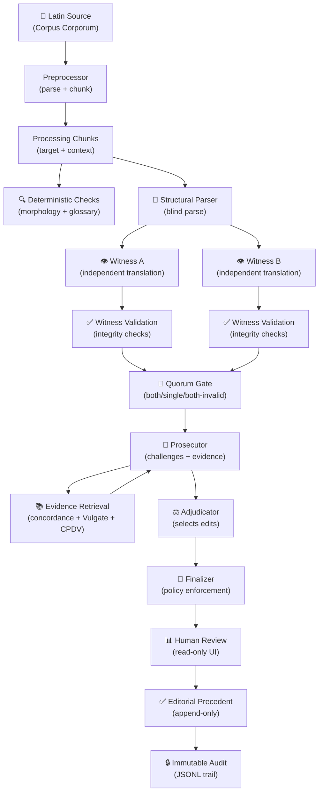

# Interpres

> **Models may propose. Evidence must verify. Agreement is not proof.**

An **evidence-first, human-in-the-loop translation pipeline** for historical texts. Interpres orchestrates multiple LLM "witnesses" through deterministic validation, bounded evidence retrieval, and explicit human review gates — producing auditable drafts where dangerous uncertainty is difficult to hide.

**Status**: Experimental. Currently validated on St Jerome's *Commentaria in Ezechielem* (Book I).

---

## What is Interpres?

Interpres is a **scholarly translation assistant**, not an autonomous translator. It:

- Takes Latin historical text as input
- Runs multiple AI models independently to propose English translations
- Validates every proposal against deterministic rules and retrieved evidence
- Flags uncertainty explicitly — `unresolved` and `human_review` are **successful outcomes**
- Produces an immutable audit trail for every decision

Think of it as a **structured workspace for translation review**, where AI suggestions are rigorously checked before any human sees them.

## What Interpres is NOT

- ❌ Not a replacement for human scholarly review
- ❌ Not proof that AI output is correct
- ❌ Not for publishing unreviewed machine translations
- ❌ Not a general-purpose RAG chatbot

## Why does this exist?

Machine translation of historical texts is risky. Latin is highly inflected, context-dependent, and often ambiguous. A single wrong word choice can invert meaning. Interpres addresses this by:

1. **Multiple independent witnesses** — Two models translate blindly; agreement is interesting but not proof
2. **Deterministic validation** — Rule-based checks catch obvious errors before humans review
3. **Evidence retrieval** — Local corpus lookup provides concrete textual evidence
4. **Explicit gates** — The system refuses to auto-approve high-severity corrections without evidence
5. **Human-in-the-loop** — Final approval always requires human review of flagged items

## Quick example

```powershell
# 1. Verify your setup
interpres doctor

# 2. Preprocess Jerome's Book I into chunks
interpres preprocess jerome-ezekiel --book 1

# 3. Build search indexes
interpres build-concordance jerome-ezekiel --book 1
interpres build-retrieval-index jerome-ezekiel

# 4. Run one chunk through the pipeline
interpres run jerome-ezekiel --book 1 --chunk 1

# 5. Open the reviewer UI to inspect results
interpres review jerome-ezekiel --book 1
```

---

## Architecture overview



### The pipeline in plain English

1. **Source → Chunks**: Raw Latin text is parsed into stable page-based units, then grouped into processing chunks (target Latin + surrounding context).

2. **Deterministic checks**: Before any AI is called, rule-based checks flag obvious issues — known mistranslations, missing words, wrong numbers, etc.

3. **Witnesses**: Two independent AI models translate the target Latin **blind** — they see only the Latin, no other witness, no morphology, no English suggestions.

4. **Validation**: Each witness response is checked for integrity: did it translate the right text? Did it copy from the source? Is it suspiciously short/long?

5. **Quorum**: 
   - `both_valid` — normal path, both witnesses trusted
   - `single_valid` — one witness failed validation, human review required
   - `both_invalid` — stop, cannot proceed

6. **Prosecutor**: A critical AI that challenges both witnesses. It asks: "Are you sure? What evidence supports this?" It can request evidence lookups.

7. **Evidence**: Local corpus search (exact Latin, normalized forms, TF-IDF/LSA semantic search), Vulgate comparison, CPDV English comparison, Whitaker's morphology.

8. **Adjudicator**: A judge AI that selects the best witness base and proposes **exact edits only** — it never rewrites the full text.

9. **Finalizer**: Applies deterministic policy:
   - Blocks auto-approval for degraded quorum
   - Requires evidence citations for positive claims
   - Sends large edits to human review
   - Normalizes `unresolved`/`human_review` away from `accepted`

10. **Human Review**: A local web UI shows machine artifacts as **read-only**. Humans make edits and resolve issues. Everything is append-only.

11. **Audit**: Every stage is content-addressed and cached. Raw model responses are immutable. The full decision trail is preserved in JSONL.

---

## Key concepts

### Witnesses
Two independent AI translations of the same Latin text. They receive **only** the target Latin — no hints, no other witness, no morphology, no English. This ensures independence.

### Quorum
The validation result for the two witnesses:
- **both_valid**: Both passed integrity checks — proceed normally
- **single_valid_a/b**: One witness is trusted, the other rejected — degraded path, mandatory human review
- **both_invalid**: Neither witness is trustworthy — stop before prosecution

### Evidence-first
No model output is trusted without verification. The prosecutor challenges every claim. Evidence receipts are persisted and verified. High-severity corrections require Grade-A/B evidence citations.

### Content-addressed cache
Every stage output is hashed. If input changes, the cache key changes. This ensures:
- Reproducibility: same inputs → same outputs
- Integrity: tampering with cached records breaks downstream provenance
- Efficiency: unchanged stages are never recomputed

### Human-in-the-loop
The system is designed so that `unresolved` and `human_review` are **successful, honest outcomes**. The goal is not to minimize human intervention, but to make human intervention **meaningful and well-informed**.

---

## Installation

### Prerequisites

- Python 3.9+
- Windows, macOS, or Linux
- 8GB+ RAM recommended
- Ollama (for local models) or OpenRouter API key

### Setup

```powershell
# Clone the repository
git clone https://github.com/your-org/interpres.git
cd interpres

# Create virtual environment
python -m venv .venv
.venv\Scripts\activate  # Windows
# source .venv/bin/activate  # macOS/Linux

# Install dependencies
pip install -r requirements.txt
pip install -e .

# Optional: Install Whitaker's Words (Latin morphology)
pip install -e dependencies/whitakers_words
```

### Configure models

Edit `projects/jerome-ezekiel/pipeline.yaml` or create `.env`:

```powershell
# .env (git-ignored)
OPENROUTER_API_KEY=sk-or-...
OLLAMA_BASE_URL=http://localhost:11434
```

### Verify setup

```powershell
interpres doctor
```

---

## Project structure

```
interpres/
├── interpres/                 # Python package (pipeline engine)
│   ├── cli.py                 # Command-line interface
│   ├── pipeline.py            # Core pipeline orchestration
│   ├── evidence.py            # Evidence retrieval and indexes
│   ├── witnesses.py           # Witness validation and contracts
│   ├── source.py              # Corpus parsing and chunking
│   ├── cache.py               # Content-addressed stage cache
│   ├── review.py              # Reviewer UI backend
│   └── ...
├── projects/
│   └── jerome-ezekiel/        # Jerome project (config + data)
│       ├── project.yaml       # Project metadata
│       ├── pipeline.yaml      # Model and pipeline config
│       ├── book1.txt          # Latin source (user-obtained)
│       ├── challenges/        # Challenge test cases
│       └── editorial/         # Human review decisions
├── tests/                     # Provider-free regression tests
├── docs/                      # Documentation
├── scripts/                   # Utility scripts
├── pyproject.toml             # Package metadata
├── requirements.txt           # Runtime dependencies
└── README.md                  # This file
```

---

## Common workflows

### First-time setup

```powershell
# 1. Verify environment
interpres doctor

# 2. Obtain source (manual step)
# Download Jerome Book I from Corpus Corporum
# Save to: projects/jerome-ezekiel/book1.txt

# 3. Preprocess
interpres preprocess jerome-ezekiel --book 1

# 4. Build indexes
interpres build-concordance jerome-ezekiel --book 1
interpres build-retrieval-index jerome-ezekiel

# 5. Smoke test (no API keys needed)
interpres run jerome-ezekiel --book 1 --chunk 1 --profile smoke --through structural_parse
```

### Running the full pipeline

```powershell
# Run all chunks for Book I
interpres run jerome-ezekiel --book 1

# Run specific chunks
interpres run jerome-ezekiel --book 1 --chunk 1 --chunk 5

# Run a range
interpres run jerome-ezekiel --book 1 --start 1 --end 10

# Resume interrupted runs
interpres resume jerome-ezekiel --book 1

# Retry only failed chunks
interpres resume-failed jerome-ezekiel --book 1
```

### Inspecting results

```powershell
# List chunks needing review
interpres review-flags jerome-ezekiel --book 1

# Inspect specific chunk cache
interpres inspect-cache --chunk book01-pl-0015A --summary

# See evidence used for a chunk
interpres inspect-evidence --chunk book01-pl-0015A

# Export full audit trail
interpres export-audit jerome-ezekiel --book 1
```

### Human review

```powershell
# Start reviewer UI
interpres review jerome-ezekiel --book 1

# In the UI:
# - Machine output is read-only
# - Edit the human translation field
# - Resolve issues in the ledger
# - Save creates append-only revision file
```

### Updating finalization policy

If you change acceptance policy (e.g., evidence requirements), reapply without recomputing upstream:

```powershell
interpres refinalize jerome-ezekiel --book 1 --start 1 --end 5
```

---

## Data and licensing

Corpus files are **not committed** to this repository due to licensing restrictions.

| Asset | Source | License |
|-------|--------|---------|
| Jerome Book I | [Corpus Corporum](https://mlat.uzh.ch/browser/cps_2.HieStr.CoInEz) | Public domain text; verify digital edition license |
| Clementine Vulgate | [vul-complete](https://github.com/theunpleasantowl/vul-complete) | Public domain |
| CPDV | [Following Imperfectly](https://github.com/following-imperfectly/cpdv-json) | Permission granted |
| Whitaker's Words | [blagae/whitakers_words](https://github.com/blagae/whitakers_words) | MIT |

See [docs/data-and-licensing.md](docs/data-and-licensing.md) for details.

---

## Testing

All tests are **provider-free** — they never call live models:

```powershell
python -m unittest discover -s tests -v
```

158 tests covering: pipeline stages, witness validation, evidence retrieval, cache integrity, audit trails, reviewer UI, challenge harness.

---

## Contributing

We welcome contributions from:

- **Latinists and patristics scholars** — review machine drafts, extend lexical traps
- **Textual critics** — validate source citations and provenance
- **Software engineers** — improve pipeline auditability and determinism

See [CONTRIBUTING.md](CONTRIBUTING.md). Model outputs are not authoritative; evidence and human review are.

---

## License

MIT License. See [LICENSE](LICENSE).

## Documentation

See [docs/index.md](docs/index.md) for all documentation, including:
- [Getting started](docs/getting-started.md) — setup and first run
- [Usage guide](docs/usage.md) — detailed CLI workflows
- [Architecture](docs/architecture.md) — how the pipeline works
- [Architecture diagrams](docs/architecture-diagram.md) — visual explanations
- [Command reference](docs/command-reference.md) — complete CLI reference
- [Reviewer UI](docs/reviewer-ui.md) — human review workspace
