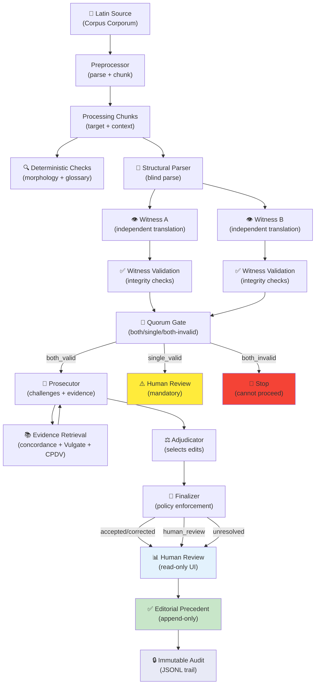
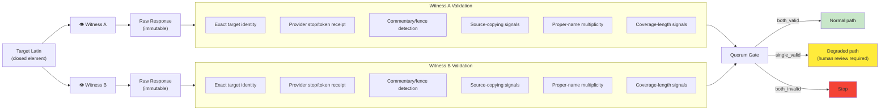
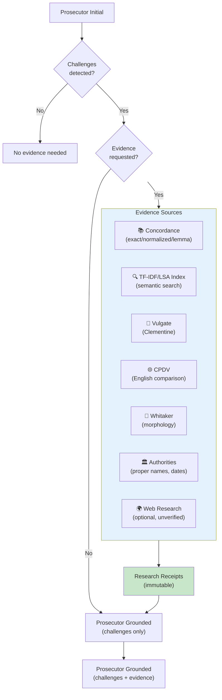
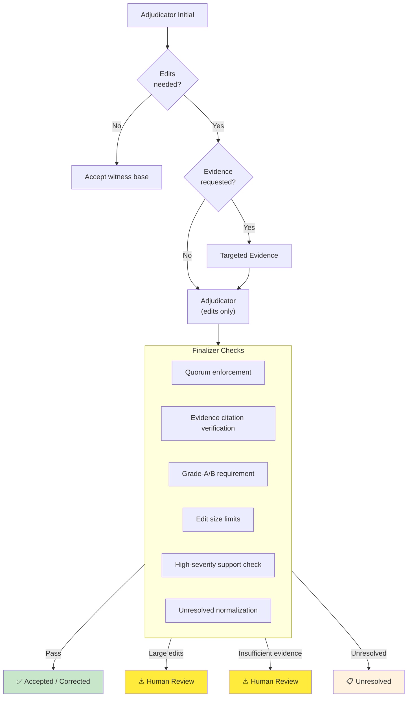
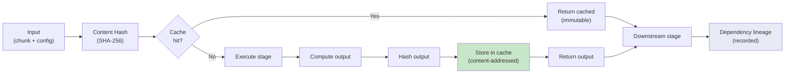
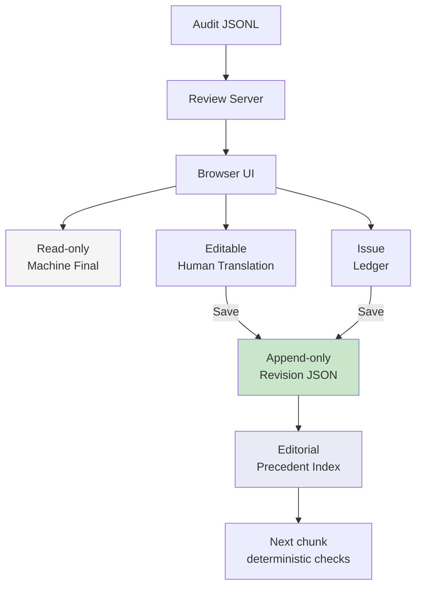
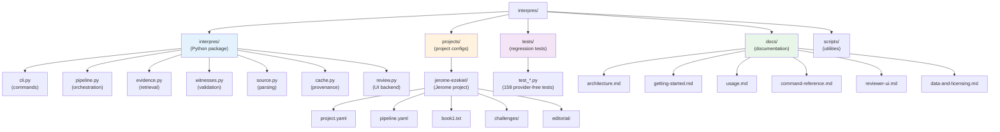
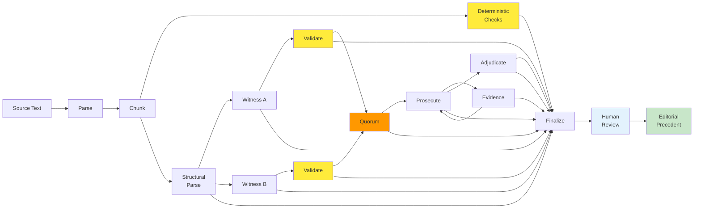
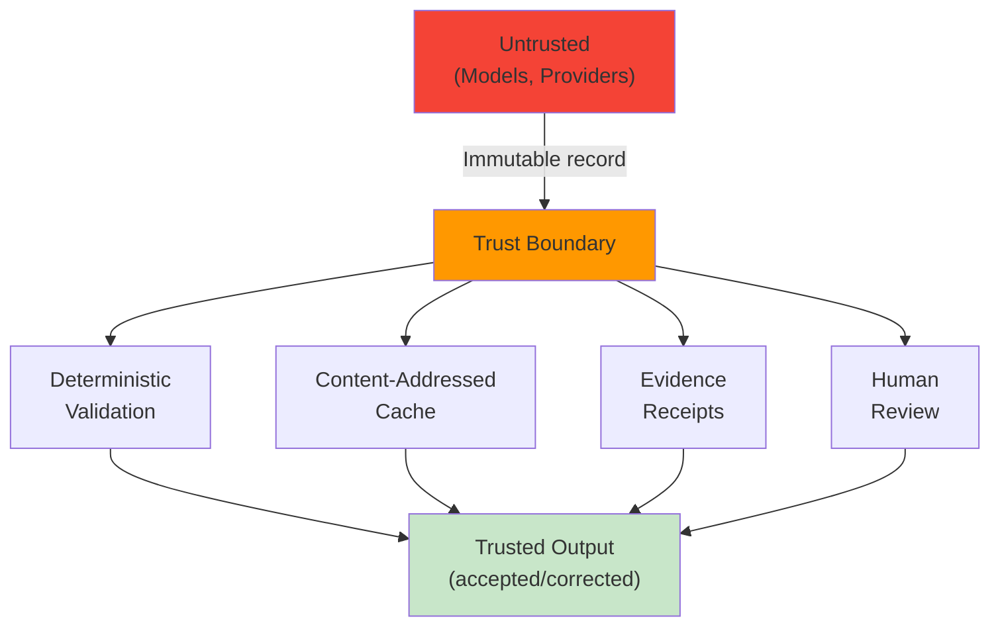

# Architecture Diagrams

Visual explanations of how Interpres works. These diagrams use [Mermaid](https://mermaid.js.org/) syntax, which renders in GitHub, GitLab, and most markdown viewers.

## Table of contents

- [High-level pipeline](#high-level-pipeline)
- [Stage detail: Witness and validation](#stage-detail-witness-and-validation)
- [Stage detail: Prosecutor and evidence](#stage-detail-prosecutor-and-evidence)
- [Stage detail: Adjudication and finalization](#stage-detail-adjudication-and-finalization)
- [Cache and provenance flow](#cache-and-provenance-flow)
- [Reviewer UI data flow](#reviewer-ui-data-flow)
- [Project structure](#project-structure)

## High-level pipeline

## Stage detail: Witness and validation

### Key principle: Witness independence

Witnesses receive **only** the target Latin. They do not receive:
- Morphology or glossary
- Structural parse output
- The other witness's translation
- Prosecutor or adjudicator output
- External English translations

This ensures independence. Agreement is interesting but not proof.

## Stage detail: Prosecutor and evidence

### Evidence contracts

Evidence retrieval is a **bounded exchange**, not a knowledge base:

1. Prosecutor proposes typed requests (exact, normalized, lemma, scripture, etc.)
2. Retrieval executes and returns receipts (hit/miss/no-match/error)
3. Prosecutor interprets receipts in the grounded stage
4. Receipts are persisted and verified — never summarized by a model

## Stage detail: Adjudication and finalization

### Finalizer policy

The finalizer applies deterministic rules:

| Rule | Threshold |
|------|-----------|
| Large edit → human review | >48 words per edit |
| Cumulative edits → human review | >96 words total |
| Replacement ratio → human review | >25% of target |
| Grade-A/B required | For positive claims |
| High-severity finding support | Each needs deterministic support or receipt |
| Degraded quorum | Blocks automatic acceptance |

## Cache and provenance flow

### Provenance chain

Each stage record contains:
- Stage name and chunk ID
- Input hash (dependency lineage)
- Output hash
- Model/provider identity (if applicable)
- Prompt digest
- Timestamp
- Raw response (immutable)

If any input changes, the cache key changes, and the stage recomputes.

## Reviewer UI data flow

### Reviewer API

The reviewer server exposes a minimal API:

| Method | Endpoint | Purpose |
|--------|----------|---------|
| GET | `/api/health` | Health check |
| GET | `/api/chunks` | List available chunks |
| GET | `/api/chunks/{id}` | Get chunk data |
| POST | `/api/chunks/{id}/editorial/revisions` | Save revision |

All other methods return 405. The server never invokes models, changes config, or mutates machine artifacts.

## Project structure

## Data flow summary

## Trust boundaries

### Trust principles

1. **Models are untrusted**: Their output is recorded but not trusted
2. **Deterministic checks are trusted**: Rules are explicit and reproducible
3. **Evidence receipts are trusted**: They are persisted and verified, not summarized
4. **Human review is trusted**: Only explicit human approval creates precedent
5. **Cache integrity is trusted**: Content-addressed hashes detect tampering
