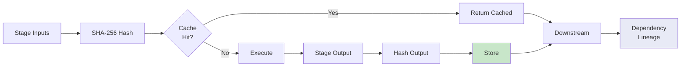

# Architecture

This document explains how Interpres works at a conceptual level. For visual diagrams, see [architecture-diagram.md](architecture-diagram.md). For Jerome-specific implementation details, see [docs/jerome-implementation.md](jerome-implementation.md).

## Core philosophy

Interpres is built on four principles:

1. **Models may propose, evidence must verify** — No model output is trusted without validation
2. **Agreement is not proof** — Two independent witnesses agreeing does not mean they are correct
3. **Explicit uncertainty is success** — `unresolved` and `human_review` are honest, successful outcomes
4. **Immutable provenance** — Every decision is recorded and verifiable

## The pipeline metaphor

Think of Interpres as a **translation court system**:

1. **Witnesses** — Two independent translators provide their versions
2. **Validation** — A bailiff checks each witness for integrity
3. **Prosecutor** — A critical reviewer challenges every claim
4. **Evidence** — A research librarian provides supporting texts
5. **Adjudicator** — A judge selects the best base and proposes edits
6. **Finalizer** — A clerk applies policy rules
7. **Human Review** — A senior editor makes the final call

No single step is trusted. Every step is recorded. The human editor always has the full context.

## Generic engine concepts

### Projects

A **project** defines a translation workflow:
- Source corpus (Latin text)
- Author/work metadata
- Books and parsing rules
- Model configuration
- Evidence sources

Projects are configured via `project.yaml` and `pipeline.yaml`. The same engine can drive different source/target language pairs.

### Source preprocessing

Raw corpus text is transformed into processing units:

1. **Parse** — Extract stable page/section boundaries from raw text
2. **Chunk** — Group source units into processing chunks (target + context)
3. **Artifacts** — Write `source.json`, `source_units.jsonl`, `chunks.jsonl`

### Witnesses

**Witnesses are independent AI translations of the target Latin.**

Key constraints:
- Witnesses receive **only** the complete target Latin
- No morphology, structural output, other witness, or external English
- Responses are immutable raw model output
- The same prompt is sent to two different models

This ensures independence. If two independent models agree, that's interesting. If they disagree, that's expected and handled.

### Witness validation

Before any downstream stage uses a witness, deterministic checks verify:

- **Exact target identity** — Did the witness translate the right text?
- **Provider receipts** — Did the model stop normally? Token counts match?
- **Commentary/fence detection** — Did the model add meta-commentary?
- **Source-copying signals** — Did the model copy Latin instead of translating?
- **Proper-name multiplicity** — Did the model translate names inconsistently?
- **Coverage-length signals** — Is the translation suspiciously short/long?

### Quorum

Validation produces one of three states:

| State | Meaning | Path |
|-------|---------|------|
| `both_valid` | Both witnesses passed | Normal two-witness path |
| `single_valid_a` | Only A passed | Degraded, mandatory human review |
| `single_valid_b` | Only B passed | Degraded, mandatory human review |
| `both_invalid` | Neither passed | Stop before prosecution |

### Deterministic checks

Rule-based checks run before and after model stages:

- **Omissions/additions** — Did the translation miss words or add extras?
- **Number/negation preservation** — Are numbers and negations preserved?
- **Known lexical traps** — Common mistranslations flagged
- **Scripture/source checks** — Does the translation match known sources?
- **Page integrity** — Are page markers preserved?
- **Roman numerals/dates** — Are dates handled correctly?

### Prosecutor

The prosecutor is a critical AI that **reviews every chunk**:

1. Receives both witnesses + deterministic checks + structural parse
2. Issues challenges: "Are you sure about this claim?"
3. Requests evidence: "Show me where this appears in the Vulgate"
4. Bounded by input/output budget gates
5. Research rounds are optional and bounded

The prosecutor is not a trusted editor. It is a **structured critic**.

### Evidence retrieval

Evidence is retrieved from local sources only (no web by default):

| Source | Type | Use |
|--------|------|-----|
| Concordance | Exact/normalized/lemma lookup | Specific form verification |
| TF-IDF/LSA index | Semantic search | Conceptual similarity |
| Clementine Vulgate | Scripture comparison | Biblical context |
| CPDV | English comparison | Translation verification |
| Whitaker's Words | Morphology/glossary | Lexical analysis |
| Authorities | Proper names, chronology | Fact verification |
| Web research | Optional, unverified | Leads only, not evidence |

Evidence retrieval is **bounded and receipt-based**:
- Requests are capped per round
- Results are capped per request
- Snippet lengths are bounded
- Every lookup produces a receipt (hit/miss/no-match/error)
- Receipts are persisted and verified

### Adjudicator

The adjudicator is a judge AI that:

1. Selects the permitted valid witness base
2. Returns **exact edits only** — never rewrites the full text
3. May request targeted evidence
4. Produces a structured proposal, not a trusted final text

The adjudicator does not trust itself. It proposes, the finalizer enforces.

### Finalizer

The finalizer applies deterministic policy:

1. **Reconstructs** draft from selected witness + adjudicator edits
2. **Enforces quorum** — degraded quorum blocks auto-approval
3. **Verifies evidence citations** — checks receipts exist and match claims
4. **Requires Grade-A/B evidence** for positive claims
5. **Checks edit sizes** — large edits → human review
6. **Supports high-severity findings** — each needs deterministic support or receipt
7. **Normalizes status** — `unresolved`/`human_review` cannot become `accepted`/`corrected`

### Human review

The reviewer UI shows machine artifacts as **read-only**:

- Machine final is immutable
- Human edits saved as append-only revision files
- Issues resolved explicitly (open/resolved/accepted)
- Approved precedents become reusable editorial guidance

### Audit trail

Every stage is **content-addressed and independently cached**:

- Raw model responses immutable
- Source fingerprints, prompt digests preserved
- Model/provider identities recorded
- Dependency lineage tracked
- Evidence provenance persisted
- Editorial history append-only

This means:
- Reproducibility: same inputs → same outputs
- Integrity: tampering breaks downstream provenance
- Efficiency: unchanged stages never recompute

## Content-addressed cache



## Trust boundaries

```
┌─────────────────────────────────────────┐
│  UNTRUSTED: Models, Providers, Web       │
│  (Output recorded, never trusted)        │
└─────────────────────────────────────────┘
                   │
                   ▼
┌─────────────────────────────────────────┐
│  TRUST BOUNDARY                         │
│  - Deterministic validation              │
│  - Content-addressed cache               │
│  - Evidence receipts                     │
│  - Human review                          │
└─────────────────────────────────────────┘
                   │
                   ▼
┌─────────────────────────────────────────┐
│  TRUSTED: Accepted/Corrected output      │
│  (Only after all checks pass)            │
└─────────────────────────────────────────┘
```

## Key invariants

1. **Raw model responses are immutable** — never modified after generation
2. **Witnesses are independent** — never see each other's output
3. **Evidence receipts are persisted** — never summarized, always verifiable
4. **Human review is mandatory for** — degraded quorum, large edits, insufficient evidence
5. **Cache is content-addressed** — input change → cache key change → recompute
6. **Audit is append-only** — never delete or modify historical records
