# Jerome Implementation

This document describes how Interpres is configured for St Jerome's *Commentaria in Ezechielem* (Book I). It covers corpus parsing, evidence sources, chunk structure, and challenge evaluation.

## Corpus source

Jerome's *Commentaria in Ezechielem* is obtained from [Corpus Corporum](https://mlat.uzh.ch/browser/cps_2.HieStr.CoInEz).

### Download

1. Navigate to the work in Corpus Corporum
2. Select Liber I (Book I)
3. Download plain text
4. Save as `projects/jerome-ezekiel/book1.txt`

### Parsing

The `parse_source()` function in `interpres/source.py` handles Corpus Corporum downloads:

1. **Removes download header** — strips metadata before the first `LIBER ...` heading
2. **Extracts footnotes** — collects footnote definitions for later linking
3. **Identifies PL page markers** — `[page NNNNX]` boundaries (stable across editions)
4. **Strips edition pagination** — removes non-canonical page numbers
5. **Preserves verse numbers** — keeps inline verse markers
6. **Links footnotes** — attaches footnote references to their definitions

Output: one clean Latin string with offset-bearing annotations.

### Source units

A **source unit** is a stable prose segment bounded by PL page markers. Each unit contains:

- `source_unit_id` — stable identifier
- `text` — clean Latin text
- `page` — PL page marker
- `fingerprint` — content hash for integrity
- `annotations` — footnotes, verse markers, edition pagination
- `provenance` — corpus, work, page, unit ID

## Chunking

The `make_chunks()` function groups source units into processing chunks:

- **Target**: 1-4 source units (the primary translation target)
- **Context**: surrounding units for discourse understanding
- **Size limits**: respects token/length budgets
- **Page markers**: preserves PL page boundaries
- **Stable IDs**: deterministic chunk IDs based on content

Chunk structure:
```json
{
  "chunk_id": "book01-pl-0015A--pl-0017A-f82ad2653b",
  "source_fingerprint": "abc123...",
  "source_units": ["u1", "u2", "u3"],
  "source_spans": [...],
  "page_markers": [...],
  "target_latin": "concaluit cor meum...",
  "context_latin": "..."
}
```

## Evidence sources

### Clementine Vulgate

The Clementine Vulgate provides scriptural context and comparison. Configured via `data/clementine-vulgate/vul.tsv`.

Usage:
- Scripture lookup: "Does this Latin phrase appear in the Vulgate?"
- Context verification: "Is the translation consistent with Vulgate wording?"
- Source authority: "What does the standard Latin Bible say here?"

### CPDV (Comparison Corpus)

The CPDV (Comparative Parsed Vulgate) provides English comparison. Configured via `data/cpdv/*.json`.

Usage:
- Translation verification: "Does the English match the CPDV?"
- Disambiguation: "Which English sense fits the Latin context?"
- Attribution: "CPDV data sourced from Following Imperfectly"

### Whitaker's Words

Whitaker's Words provides Latin morphology and lexical analysis. Configured via the `whitakers_words` package.

Usage:
- Morphological analysis: "What are the possible forms of 'concaluit'?"
- Lexical traps: "Common mistranslations to flag"
- Sense disambiguation: "Which sense fits the context?"

### Known lexical traps

The `KNOWN_TRAPS` dictionary in `glossary.py` documents observed mistranslations:

```python
KNOWN_TRAPS = {
    "concaluit": ["cold"],  # Means "grew hot", not "grew cold"
    # ... more traps
}
```

These are checked deterministically before any model is called.

### Concordance

The Jerome concordance contains:

- Exact Latin text for every source unit
- Normalized Latin (casefolded, diacritics removed, j→i, v→u)
- Deterministic lemmas from Whitaker's
- Page and book references
- Provenance metadata

Lookup modes:
- **Exact** — match exact Latin text
- **Normalized** — match normalized form
- **Lemma** — match by lemma

Each hit returns surrounding context units (preceding + following).

### TF-IDF/LSA retrieval index

A persisted local semantic index built from the concordance:

- **TF-IDF** — term frequency-inverse document frequency
- **LSA** — truncated SVD for latent semantic analysis
- **Deterministic** — same input always produces same index
- **Content-addressed** — index tied to concordance and source digests

Search returns:
- Retrieved Latin text (never summarized)
- Provenance (source unit, page, book)
- Score and rank

## Challenge set

The challenge set (`projects/jerome-ezekiel/challenges/challenge_set.jsonl`) contains planted errors for pipeline validation:

```json
{
  "case_id": "agreed-wrong-lexical",
  "latin": "concaluit cor meum",
  "candidate_english": "my heart grew cold",
  "mutation": "plausible_wrong_lexical_sense",
  "expected_error_types": ["lexical"],
  "clean": false
}
```

Challenge types:
- `plausible_wrong_lexical_sense` — wrong word sense
- `plausible_wrong_structural_parse` — wrong grammar
- `subtle_omission` — missing word
- `subtle_addition` — extra word
- `number_swap` — wrong number
- `negation_swap` — wrong negation

The challenge harness:
1. Injects the planted candidate into both witnesses
2. Runs the full pipeline
3. Checks if the error is detected and corrected
4. Records detection stage and evidence used

## Evaluation metrics

```python
metrics = {
    "full_pipeline_completed_cases": 1,
    "full_pipeline_failures": 0,
    "deterministic_detections": 0,
    "planted_detected": ["lexical"],
    "planted_missed": [],
    "unexpected_flags": [],
    "stage_first_detected": {
        "lexical": "prosecutor_initial"
    }
}
```

## Editorial precedent

Approved human resolutions become editorial precedent:

1. **Approval** — Revision is explicitly approved, not just saved
2. **Resolution** — Issue outcome is `resolved`
3. **Reuse enabled** — Editor marks it for reuse
4. **Exact wording** — Latin and English are present

Precedents are indexed separately from corpus evidence. They appear as `editorial_precedents` in deterministic checks and are visible to prosecutor/adjudicator.

**Important**: Witnesses remain blind to precedents. Precedents are human guidance, not source proof.

## Jerome-specific configuration

### Model assignments

Configured in `projects/jerome-ezekiel/pipeline.yaml`:

| Role | Model | Purpose |
|------|-------|---------|
| Witness A | Ollama `qwen3.5:9b` | Independent translation |
| Witness B | Ollama `mistral-small3.2:24b` | Independent translation |
| Structural parser | Ollama `qwen3.8:27b` | Blind grammar analysis |
| Prosecutor | OpenRouter or local | Critical review |
| Adjudicator | Ollama `qwen3.8:27b` | Edit selection |

### Chunking parameters

```yaml
chunking:
  target_units: 4
  max_chars: 8000
  min_chars: 500
  sentence_boundary: true
```

### Evidence configuration

```yaml
evidence:
  prosecutor_research_rounds: 1
  adjudicator_research_rounds: 1
  max_requests_per_round: 5
  max_results_per_request: 10
  snippet_chars: 500
```

## Directory layout

```
projects/jerome-ezekiel/
├── project.yaml          # Project metadata
├── pipeline.yaml         # Model and pipeline config
├── book1.txt             # Latin source (user-obtained)
├── README.md             # Project-specific notes
├── challenges/
│   └── challenge_set.jsonl  # Challenge test cases
└── editorial/
    └── .gitkeep           # Editorial revisions stored here
```

## Data flow for Jerome

```mermaid
flowchart LR
    A["book1.txt<br/>(Corpus Corporum)"] --> B["parse_source()"]
    B --> C["source_units.jsonl"]
    C --> D["make_chunks()"]
    D --> E["chunks.jsonl"]
    
    E --> F["Witness A<br/>(qwen3.5:9b)"]
    E --> G["Witness B<br/>(mistral-small3.2:24b)"]
    
    F --> H["validate_witness()"]
    G --> I["validate_witness()"]
    
    H --> J["quorum_gate"]
    I --> J
    
    J --> K["prosecutor<br/>(qwen3.8:27b)"]
    K --> L["evidence_retrieval"]
    
    subgraph L [Evidence]
        L1["concordance.jsonl"]
        L2["retrieval-index.json"]
        L3["vul.tsv"]
        L4["cpdv/*.json"]
        L5["whitakers_words"]
    end
    
    L --> K
    K --> M["adjudicator<br/>(qwen3.8:27b)"]
    M --> N["finalize()"]
    
    N --> O["human_review"]
    O --> P["editorial/revisions/"]
    
    style A fill:#fff3e0
    style L fill:#e3f2fd
    style P fill:#c8e6c9
```


